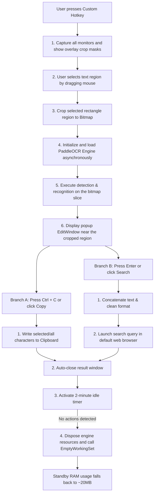

<div align="center">
  <h1>SnapFind</h1>
  <p>High-performance local screenshot OCR and instant search tool built with .NET 8.0 + WPF</p>
  <p>
    <a href="README.md">简体中文</a> | <b>English</b>
  </p>
</div>

---

**SnapFind** is a high-performance, lightweight, and offline-first screenshot OCR and search utility deeply customized for Windows. Integrating the PaddleOCR engine, it offers millisecond-level responsiveness. All screen-capturing and text extraction actions run 100% locally on your machine, protecting user privacy with zero data transmission, whilst providing quick search and automated Ctrl+C copy-to-close behavior.

## Core Features

### Smart Screenshot & Offline Local OCR
- **Zero-Network Local Inference**: Integrates lightweight PP-OCRv6_tiny Chinese/English models. Executes purely offline on your local device, guaranteeing zero privacy leakage risks.
- **Multi-Monitor & High DPI Adaptation**: Traverses screen monitors using Win32 API to fetch independent DPI scale factors. Prevents screenshot shifts or black screen overlaps across multiple monitors.
- **Customizable Global Hotkeys**: Default hotkey `Alt + W` (fully customizable modifier keys and character combinations) invokes screen crop overlay in milliseconds from any third-party app.

### Interactive Result Dialog
- **Quick Copy & Auto-Close**: Press `Ctrl + C` inside the result popup to automatically extract selected text (or all text if no selection exists), write it to the clipboard, and **instantly destroy and close the window**.
- **Instant Search Integration**: Press `Enter` (or click the "Search" button) to merge multi-line text paragraphs and launch the query in your system's default web browser.
- **Startup Registry Self-Healing**: Sets Windows Run registry keys directly from Settings. Automatically repairs pathways on boot and toggles from the tray menu.

### Optimization & Lifecycle
- **Smart Idle Memory Reclamation**: Once OCR finishes, the engine initiates a 2-minute inactivity timer. On expiration, it disposes of the active inference instances and calls the Windows `EmptyWorkingSet` kernel API to clean process pages, reducing background standby memory usage from ~400MB **down to just 20MB**.
- **Mutex Single Instance Guard**: Built on a system-level `Mutex` flag to avoid hotkey double-triggering conflicts.

## Project Structure

```text
SnapFind/
├── src/                             # Source code folder
│   ├── App.xaml                     # Application entry point XAML
│   ├── App.xaml.cs                  # Lifecycle control, Mutex guard, Registry self-healing, and Tray context menu
│   ├── AssemblyInfo.cs              # Assembly metadata assembly settings
│   ├── Config.cs                    # Configuration serialization and AppConfig manager (JSON)
│   ├── EditWindow.xaml              # Result display, text box editing, copy & search UI layout
│   ├── EditWindow.xaml.cs           # Positioning logic, Ctrl+C shortcut handler, default browser search
│   ├── HotkeyHelper.cs              # Bottom-level wrapper for Win32 RegisterHotkey / UnregisterHotkey
│   ├── OcrHelper.cs                 # PaddleOCR lifecycle driver, idle timer memory cleanup
│   ├── ScreenshotWindow.xaml        # Capture overlay window XAML
│   ├── ScreenshotWindow.xaml.cs     # Multi-monitor rendering, region selecting, DPI scale mapping, and bitmap cropping
│   ├── SettingsWindow.xaml          # System global settings panel (Hotkeys, Search engine base, Windows startup toggle)
│   ├── SettingsWindow.xaml.cs       # Settings window code-behind logic
│   ├── SnapFind.csproj              # .NET 8.0 WPF project configuration
│   └── setup.iss                    # Inno Setup installer script
├── libs/                            # Native PaddleOCR C++ DLL binaries and model resources
│   ├── inference/                   # Model folders (Detection, classifier, recognition, ppocr_keys dictionary)
│   └── *.dll                        # Paddle, OpenCV, TBB C++ runtime dependencies (Required for portables)
├── cache/                           # Temporary cache directory (Ignored by Git)
│   ├── config.json                  # User hotkeys and preference JSON configuration
│   └── debug_crop.png               # Temporary bitmap slice from the latest crop action
├── releases/                        # Packaged outputs directory (Ignored by Git)
│   ├── installers/                  # Timestamped Inno Setup install packages
│   └── portables/                   # Timestamped portable ZIP archives
├── SnapFind.exe                     # Compiled program launcher in the workspace root (Git Ignored)
├── .gitignore                       # Git ignore rules configuration
└── README.md                        # Self-description document (Chinese)
```

## Environment Requirements

- Operating System: Windows 10 / Windows 11 (64-bit only)
- Runtime: [.NET 8.0 Desktop Runtime (x64)](https://dotnet.microsoft.com/en-us/download/dotnet/8.0)

## Quick Start

### 1. Clone Repository
```bash
git clone <your-repository-url> SnapFind
cd SnapFind
```

### 2. Configuration Options
On startup, a default configuration file will be auto-generated in `cache/config.json`. You can modify it manually:

```json
{
  "SearchEngineUrl": "https://www.google.com/search?q=",
  "HotkeyModifiers": "Alt",
  "HotkeyKey": "W",
  "StartWithWindows": false
}
```

| Key | Type | Default | Description |
| :--- | :--- | :--- | :--- |
| `SearchEngineUrl` | String | `https://www.google.com/search?q=` | Target URL prefix opened when clicking "Search" or pressing Enter |
| `HotkeyModifiers` | String | `Alt` | Modifier keys (Supports combinations like `Control`, `Alt`, `Shift`) |
| `HotkeyKey` | String | `W` | Primary activator key (Supports letters and standard virtual keys) |
| `StartWithWindows`| Boolean| `false` | Enable boot launch with Windows |

### 3. Run and Debug
Run the standard SDK command inside the `src/` directory:
```bash
cd src
dotnet run
```

## Build & Compile Guide

If you make modifications to the codebase, follow the synchronization steps below:

### 1. Publish Portable (Green Edition)
Execute the single-file publish CLI command in the `src` directory:
```bash
dotnet publish -c Release -r win-x64 -p:PublishSingleFile=true --self-contained false
```
1. After the publish completes, copy the generated executable `SnapFind.exe` back to the repository root directory, overwriting the old version.
2. Package the root `SnapFind.exe` and the `libs/` folder together into a ZIP archive and store it under `releases/portables/`.

### 2. Generate Installer Package
Ensure you have **Inno Setup 6** installed on your workstation, and compile `setup.iss`:
```bash
"C:\Program Files (x86)\Inno Setup 6\ISCC.exe" src/setup.iss
```
Once completed, a timestamped binary installer will output to `releases/installers/` named `SnapFindSetup_v1.0.0_yyyyMMdd_hhnn.exe`.

## Data Flow & Architecture

From hotkey trigger to clipboard output and window close, the flow is handled as follows:



### Memory Optimization Mechanism
To maintain a small footprint on user machines, SnapFind applies an aggressive cleanup cycle:
1. Calls `PaddleOCREngine.Dispose()` to unload C++ unmanaged engines and variables.
2. Triggers the Windows kernel `EmptyWorkingSet` API to push process working pages to the page file.
3. The next screenshot action automatically re-instantiates the engine silently, ensuring fast millisecond response while keeping background standby RAM low.

## FAQs

**Q: Prompted with `DllNotFoundException` on launch?**
> **A**: Make sure the native dependency directory `libs/` is in the same directory as the executable `SnapFind.exe`. It contains compiled C++ DLLs and model weights necessary for offline inference.

**Q: Nothing happens when pressing the shortcut `Alt+W`?**
> **A**: The shortcut key might be held globally by another application (e.g. GeForce Experience, Discord, WeChat). Click the Settings icon in the tray context menu to map a different modifier combination.

**Q: Auto-start on boot does not work?**
> **A**: Auto-launch configures registry run entries under `HKCU\Software\Microsoft\Windows\CurrentVersion\Run`. Check if antivirus/security software blocked this registry edit.

## Contributing

1. Fork the project on GitHub.
2. Create your feature branch: `git checkout -b feature/your-feature-name`.
3. Commit your changes: `git commit -m 'feat: Add auto-translate helper'`.
4. Push to the branch: `git push origin feature/your-feature-name`.
5. Open a Pull Request (PR) on GitHub.

## License

Distributed under the [MIT License](LICENSE).

## Acknowledgments

- [PaddleOCR](https://github.com/PaddlePaddle/PaddleOCR) — Superb OCR architecture.
- [PaddleOCRSharp](https://github.com/sdcb/PaddleOCRSharp) — Wrapper library bringing PaddleOCR easily into C#/.NET.
- [Inno Setup](https://jrsoftware.org/isinfo.php) — Fully featured installation builder.

---

> **Disclaimer**: This is an unofficial open-source efficiency tool. All inference calculations are executed entirely offline in your local environment. It does not send any screen contents or captured strings to external servers.
