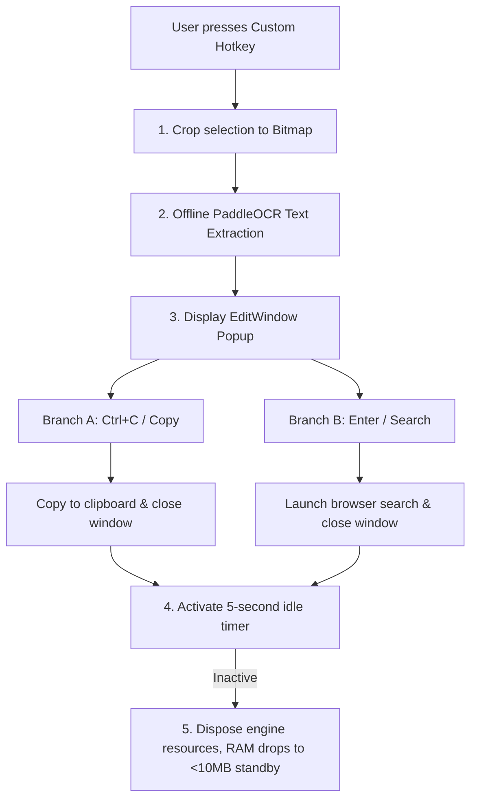

<div align="center">
  <h1>SnapFind</h1>
  <p>High-performance local screenshot OCR and instant search tool built with .NET 8.0 + WPF</p>
  <p>
    <a href="README.md">简体中文</a> | <b>English</b>
  </p>
</div>

---

**SnapFind** is a high-performance, lightweight, and offline-first screenshot OCR and search utility deeply customized for Windows. Integrating the PaddleOCR engine, it offers millisecond-level responsiveness. All screen-capturing and text extraction actions run 100% locally on your machine, protecting user privacy with zero data transmission, whilst providing quick search and automated Ctrl+C copy-to-close behavior.

## Core Features

### Smart Screenshot & Offline Local OCR
- **Zero-Network Local Inference**: Integrates the lightweight PaddleOCR v6 engine, supporting dynamic runtime hot-swapping between **PP-OCRv6_tiny** and **PP-OCRv6_small** models. Runs 100% locally on your machine with zero data privacy leakage risk.
- **Multi-Monitor & High DPI Adaptation**: Traverses screen monitors using Win32 API to fetch independent DPI scale factors. Prevents screenshot shifts or black screen overlaps across multiple monitors.
- **Dual Customizable Global Hotkeys**: Supports setting a global screenshot hotkey (default: `Ctrl + Alt + S`) and a global control panel hotkey (default: `Ctrl + Alt + C`, opening settings panel directly) for millisecond-level quick invocation.

### Multi-Region Selection & Cross-Screen Staging
- **Multi-Region Capture & Smooth Repositioning**: Supports continuous multiple box selections on the same screen. Selected regions can be smoothly dragged and repositioned; selection control pills feature 3px rounded borders and neutral theme badges for a clean visual appearance.
- **Cross-Screen Sessions & Direct \"Insert\" Flow**: Switch between different apps and windows while staging previous selections. The canvas remains 100% clean without ghost overlays, and a dedicated **\"Insert\"** button on the toolbar opens the staged drawer instantly.
- **Visual Staged Drawer & Card Reordering**: Expandable top drawer displaying real-time thumbnail cards with **\"Move Up\"**, **\"Move Down\"**, and **\"Delete\"** controls for easy insertion between previous captures.
- **Full Undo Support (Ctrl+Z)**: Instant undo for accidental deletions or reordering operations.

### Unified Control Center & Modern UI
- **Unified 3-in-1 Control Center**: Blends Settings, About, and Update Notifications into a single unified dashboard window with a clean WinUI-style navigation sidebar.
- **Seamless Bilingual Localization**: Supports real-time dynamic switching between "Simplified Chinese" and "English", fully covering the Control Center, tray menus, result cards, and Inno Setup installer wizard.
- **Dual-Source Updates & Smooth Installation**: Queries both GitHub and Gitee concurrently to detect updates and fetch the highest version. Automatically displays a progress bar window during installation, then auto-closes and launches the new version smoothly.
- **System Theme & Rounded Corners**: Supports light/dark themes and Windows 11 native rounded corners and dropshadows automatically.
- **Ultra-thin Fluent Scrollbar**: Customizes scrollbars to a thin 6px width capsule shape with default semi-transparent opacity (0.4) that fades in (0.8) on mouse hover.
- **100% Native Win32 System Tray Menu**: Simplified context menu options down to "截图 OCR 搜索" (Screenshot OCR), "控制面板" (Control Panel), and "退出" (Exit) for a clean visual alignment with Windows 11 Fluent Acrylic blur effects.

### Interactive Result Dialog
- **Quick Copy & Auto-Close**: Press `Ctrl + C` inside the result popup to automatically extract selected text (or all text if no selection exists), write it to the clipboard, and **instantly destroy and close the window**.
- **Instant Search Integration**: Press `Enter` (or click the "Search" button) to merge multi-line text paragraphs and launch the query in your system's default web browser.
- **Startup Registry Self-Healing**: Sets Windows Run registry keys directly from Settings. Automatically repairs pathways on boot and toggles from the tray menu.

### Optimization & Lifecycle
- **Smart Idle Memory Reclamation**: Once OCR finishes, the engine initiates a **5-second** inactivity timer. On expiration, it disposes of the active inference instances and calls the Windows `EmptyWorkingSet` kernel API to clean process pages, reducing background standby memory usage from ~40MB **down to just under 10MB**.
- **Mutex Single Instance Guard**: Built on a system-level `Mutex` flag to avoid hotkey double-triggering conflicts.

## Project Structure

```text
SnapFind/
├── src/                             # Source code folder
│   ├── App.xaml                     # Application entry point XAML
│   ├── App.xaml.cs                  # Lifecycle control, Mutex guard, Registry self-healing, and Tray context menu
│   ├── AssemblyInfo.cs              # Assembly metadata assembly settings
│   ├── Config.cs                    # Configuration serialization and AppConfig manager (JSON)
│   ├── EditWindow.xaml              # Result display, text box editing, copy & search UI layout
│   ├── EditWindow.xaml.cs           # Positioning logic, Ctrl+C shortcut handler, default browser search
│   ├── HotkeyHelper.cs              # Bottom-level wrapper for Win32 RegisterHotkey / UnregisterHotkey
│   ├── Localization.cs              # Global bilingual localization and string dictionary manager
│   ├── MultiSessionBarWindow.xaml   # Staged multi-session pill bar & visual drawer UI
│   ├── MultiSessionBarWindow.xaml.cs# Thumbnail card rendering, Move Up/Down reordering, and Undo logic
│   ├── OcrHelper.cs                 # PaddleOCR lifecycle driver, idle timer memory cleanup
│   ├── ScreenshotWindow.xaml        # Capture overlay window XAML
│   ├── ScreenshotWindow.xaml.cs     # Multi-monitor rendering, region selecting, DPI scale mapping, and bitmap cropping
│   ├── SettingsWindow.xaml          # Unified Control Center Window (Sidebar navigation, Settings/About/Notifications tabs, custom scrollbars)
│   ├── SettingsWindow.xaml.cs       # Control Center backend logic (Tab switching, update check & stream downloader, validation)
│   ├── SnapFind.csproj              # .NET 8.0 WPF project configuration
│   └── setup.iss                    # Inno Setup installer script
├── libs/                            # Native PaddleOCR C++ DLL binaries and model resources
│   ├── inference/                   # Model folders (Detection, classifier, recognition, ppocr_keys dictionary)
│   └── *.dll                        # Paddle, OpenCV, TBB C++ runtime dependencies (Required for portables)
├── cache/                           # Temporary cache directory (Ignored by Git)
│   ├── config.json                  # User hotkeys and preference JSON configuration
│   └── debug_crop.png               # Temporary bitmap slice from the latest crop action
├── releases/                        # Packaged outputs directory (Ignored by Git)
│   ├── installers/                  # Incremental versioned of Inno Setup install packages (e.g., SnapFindSetup_v2.0.0.exe)
│   └── portables/                   # Incremental versioned of portable ZIP archives (e.g., SnapFindPortable_v2.0.0.zip)
├── backup/                          # Dedicated backup cleanup tools folder (Fixed)
│   ├── backup.ps1                   # One-click PowerShell script to clean up compilation caches & builds
│   └── BACKUP_GUIDE.md              # Backup cleanup guidelines documentation
├── LICENSE.md                       # Official Open Source License (English for GitHub auto-detection)
├── LICENSE.zh.md                    # Open Source License (Chinese translation)
├── SnapFind.exe                     # Compiled program launcher in the workspace root (Git Ignored)
├── .gitignore                       # Git ignore rules configuration
├── README.en.md                     # Readme documentation (English)
└── README.md                        # Self-description document (Chinese)
```

## Environment Requirements

- Operating System: Windows 10 / Windows 11 (64-bit only)
- Runtime: [.NET 8.0 Desktop Runtime (x64)](https://dotnet.microsoft.com/en-us/download/dotnet/8.0)

## Quick Start

### 1. Clone Repository
```bash
git clone <your-repository-url> SnapFind
cd SnapFind
```

### 2. Configuration Options
On startup, a default configuration file will be auto-generated in `cache/config.json`. You can modify it manually:

```json
{
  "SearchEngineUrl": "https://www.google.com/search?q=",
  "HotkeyModifiers": "Control,Alt",
  "HotkeyKey": "S",
  "StartWithWindows": false,
  "OcrModel": "PP-OCRv6_tiny",
  "IgnoredVersion": "",
  "ControlPanelHotkeyModifiers": "Control,Alt",
  "ControlPanelHotkeyKey": "C",
  "AutoCopyToClipboard": false,
  "Language": "zh-CN"
}
```

| Key | Type | Default | Description |
| :--- | :--- | :--- | :--- |
| `SearchEngineUrl` | String | `https://www.google.com/search?q=` | Target URL prefix opened when clicking "Search" or pressing Enter |
| `HotkeyModifiers` | String | `Control,Alt` | Modifier keys for screenshot hotkey (Supports combinations like `Control`, `Alt`, `Shift`) |
| `HotkeyKey` | String | `S` | Primary activator key for screenshot hotkey (Supports letters and standard virtual keys) |
| `ControlPanelHotkeyModifiers` | String | `Control,Alt` | Modifier keys for control panel hotkey |
| `ControlPanelHotkeyKey` | String | `C` | Primary activator key for control panel hotkey |
| `StartWithWindows`| Boolean| `false` | Enable boot launch with Windows |
| `OcrModel` | String | `PP-OCRv6_tiny` | Selected OCR model (`PP-OCRv6_tiny` or `PP-OCRv6_small`) |
| `AutoCopyToClipboard` | Boolean | `false` | Automatically copy recognized text to clipboard upon OCR completion |
| `Language` | String | `zh-CN` | Interface language code (`zh-CN` for Simplified Chinese, `en-US` for English) |

### 3. Run and Debug
Run the standard SDK command inside the `src/` directory:
```bash
cd src
dotnet run
```

## Build & Compile Guide

To simplify development workflows, a one-click automated packaging script `src/build.ps1` is provided at the repository root. It automatically performs:
1. Auto-calculating the next incremental version number based on existing packages in `releases/` (following `x.y.z` format).
2. Running `dotnet publish` to compile a single-file executable.
3. Overwriting `SnapFind.exe` in the repository root.
4. Syncing DLL dependencies from `libs/` and compressing them using 7-Zip with the LZMA algorithm to generate `releases/portables/SnapFindPortable_vX.Y.Z.zip`, keeping portable package size strictly under 100MB.
5. Generating the optimized installer package `releases/installers/SnapFindSetup_vX.Y.Z.exe` using LZMA2 Ultra solid compression (with built-in silent update auto-restart logic).

### One-Click Packaging Command
Simply run the following command in PowerShell with Administrator privileges:
```powershell
powershell -ExecutionPolicy Bypass -File src/build.ps1
```

### One-Click Project Cleanup
To clean up compilation caches, historical builds, and the root binary before manual zipping/backup, run this script in PowerShell with Administrator privileges:
```powershell
powershell -ExecutionPolicy Bypass -File backup/backup.ps1
```

## Data Flow & Architecture

From hotkey trigger to clipboard output and window close, the flow is handled as follows:



### Memory Optimization Mechanism
To maintain a small footprint on user machines, SnapFind applies an aggressive cleanup cycle after **5 seconds** of inactivity:
1. Calls `PaddleOCREngine.Dispose()` to unload C++ unmanaged engines and variables.
2. Triggers the Windows kernel `EmptyWorkingSet` API to push process working pages to the page file.
3. The next screenshot action automatically re-instantiates the engine silently, ensuring fast millisecond response while keeping background standby RAM low (approx. 10MB background standby).

## FAQs

**Q: Prompted with `DllNotFoundException` on launch?**
> **A**: Make sure the native dependency directory `libs/` is in the same directory as the executable `SnapFind.exe`. It contains compiled C++ DLLs and model weights necessary for offline inference.

**Q: Nothing happens when pressing the shortcut Ctrl+Alt+S?**
> **A**: The shortcut key might be held globally by another application. Click the Settings icon in the tray context menu to map a different modifier combination.

**Q: Auto-start on boot does not work?**
> **A**: Auto-launch configures registry run entries under `HKCU\Software\Microsoft\Windows\CurrentVersion\Run`. Check if antivirus/security software blocked this registry edit.

## Contributing

1. Fork the project on GitHub.
2. Create your feature branch: `git checkout -b feature/your-feature-name`.
3. Commit your changes: `git commit -m 'feat: Add auto-translate helper'`.
4. Push to the branch: `git push origin feature/your-feature-name`.
5. Open a Pull Request (PR) on GitHub.

## License

Distributed under the [MIT License](LICENSE.md) ([Chinese translation](LICENSE.zh.md)).

## Acknowledgments

- [PaddleOCR](https://github.com/PaddlePaddle/PaddleOCR) — Superb OCR architecture.
- [Inno Setup](https://jrsoftware.org/isinfo.php) — Fully featured installation builder.

---

> **Disclaimer**: This is an unofficial open-source efficiency tool. All inference calculations are executed entirely offline in your local environment. It does not send any screen contents or captured strings to external servers.
