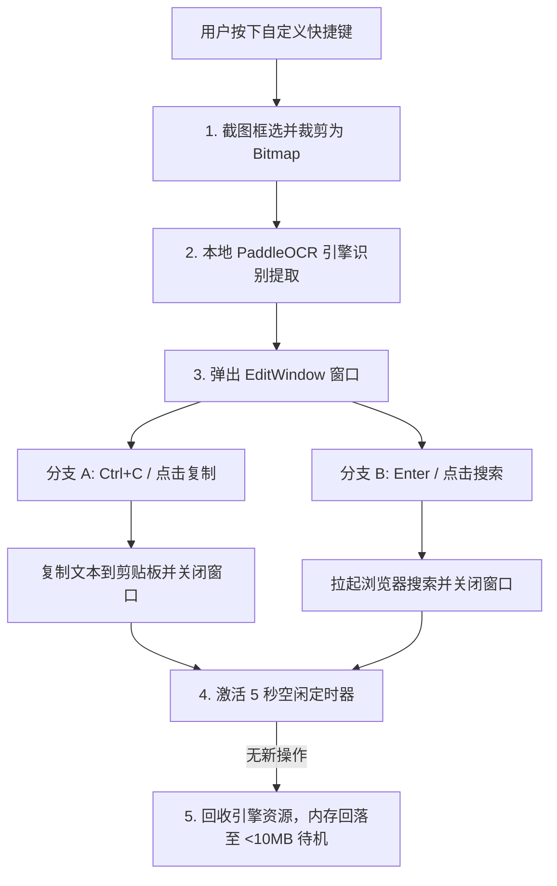

<div align="center">
  <h1>SnapFind</h1>
  <p>基于 .NET 8.0 + WPF 开发的本地高能截图 OCR 识别与极速搜索工具</p>
  <p>
    <b>简体中文</b> | <a href="README.en.md">English</a>
  </p>
</div>

---

**SnapFind** 是一款专为 Windows 系统深度定制的高性能、纯本地离线截图 OCR 识别与搜索工具。它集成 PaddleOCR 引擎，拥有毫秒级的截图唤起速度，数据完全保留在本地，完美保障用户隐私，并支持一键搜索与快捷键复制并关闭窗口。

## 核心特性

### 智能截图与本地离线 OCR
- **本地零联网推理**：集成轻量化 PaddleOCR v6 中英文检测与识别引擎，支持 **PP-OCRv6_tiny** 与 **PP-OCRv6_small** 双模型动态热切换，无需联网，零隐私泄露风险。
- **多显示器与高 DPI 自适应**：通过 Win32 API 遍历所有屏幕，自动适配监视器不同的高 DPI 缩放比例，杜绝跨屏截图下的偏移和黑屏。
- **双自定义全局热键**：支持全局截图热键（默认 `Ctrl + Alt + S`）与控制面板热键（默认 `Ctrl + Alt + C`，一键拉起设置窗口），可在任意界面毫秒级快速唤起。

### 统一控制中心与现代 UI
- **三合一控制中心**：将“设置”、“关于”、“更新通知”融合为统一的控制中心窗口。拥有极简的 WinUI 侧边栏，支持无阻碍平滑切换。
- **多语言无缝切换**：原生内置“简体中文”与“English”双语界面热切换，设置面板、系统托盘、结果卡片及安装向导实现 100% 全面覆盖。
- **双源并发更新比对与流畅安装**：同时并发查询 GitHub 与 Gitee 更新，自动比对并获取最高版本。安装更新时自动展示进度条窗口，完成后自动退出并拉起新版本，体验连贯。
- **自适应系统主题与圆角**：支持暗色/亮色主题及 Windows 11 原生 DWM 圆角与阴影特效。
- **极细 Fluent 滚动条**：自定义了 6 像素极细半透明滚动条（普通悬浮低可见度， hover 状态渐显），带来极佳的系统原生感。
- **100% Win32 原生系统托盘菜单**：精简托盘右键选项为“截图 OCR 搜索”、“控制面板”、“退出”，极简纯文字设计，完美适配 Windows 11 亚克力磨砂及云母毛玻璃特效。

### 人性化结果交互
- **快捷复制并自动关闭**：在文字框卡片内直接按下键盘快捷键 `Ctrl + C`，系统将智能提取选中段落（若无选中则复制全部），写入剪贴板的同时**自动销毁并关闭窗口**。
- **一键搜索引擎检索**：编辑框内直接按 `Enter`（或点击“搜索”按钮）可自动合并多行文本，拉起系统默认浏览器调用搜索引擎直接搜索。
- **开机自启动自愈**：通过 Windows 注册表配置自启动项，并在启动时检查自愈，支持托盘一键开启或关闭。

### 性能与架构优化
- **智能内存自动回收**：在 OCR 运行结束后，引擎会启动 **5 秒**不活动倒计时。超时无操作将自动卸载推理引擎并调用 Windows `EmptyWorkingSet` 对物理内存进行深度压缩，使后台待机内存由推理时的 ~40MB **骤降至仅约 10MB 以内**。
- **单例互斥锁守护**：基于系统级 `Mutex` 构建单例保护，防止快捷键误连击导致程序多开冲突。

## 项目结构

```text
SnapFind/
├── src/                             # 软件源代码目录
│   ├── App.xaml                     # 应用程序入口 XAML 声明
│   ├── App.xaml.cs                  # 应用初始化、互斥单例、注册表自启动自愈及托盘控制
│   ├── AssemblyInfo.cs              # 程序集元数据配置
│   ├── Config.cs                    # 配置文件读取、保存与 AppConfig 管理器 (JSON)
│   ├── EditWindow.xaml              # 识别结果展示、编辑、复制与搜索 UI 布局
│   ├── EditWindow.xaml.cs           # 结果窗口定位、Ctrl+C 拦截自动复制关闭、浏览器检索
│   ├── HotkeyHelper.cs              # Win32 RegisterHotkey / UnregisterHotkey 热键钩子底层封装
│   ├── Localization.cs              # 全局中英文多语言与本地化文本管理器
│   ├── OcrHelper.cs                 # PaddleOCR 引擎生命周期控制、空闲定时内存优化压缩
│   ├── ScreenshotWindow.xaml        # 截图遮罩层 XAML 布局
│   ├── ScreenshotWindow.xaml.cs     # 多屏幕截图绘制、框选、DPI 换算与位图切片处理
│   ├── SettingsWindow.xaml          # 统一控制中心窗口 (含导航侧栏，关于、设置、更新通知面板，薄滚动条)
│   ├── SettingsWindow.xaml.cs       # 控制中心逻辑 (侧栏切换、版本检查与自动下载安装、配置及防冲突校验)
│   ├── SnapFind.csproj              # .NET 8.0 WPF 项目工程配置文件
│   └── setup.iss                    # Inno Setup 自动化安装包生成脚本
├── libs/                            # PaddleOCR C++ 原生 DLL 动态库与模型文件目录
│   ├── inference/                   # OCR 推理模型 (检测、方向分类、识别及 ppocr_keys 字典)
│   └── *.dll                        # Paddle、OpenCV、TBB 核心推理 C++ 依赖 (免安装必选)
├── cache/                           # 本地运行时临时及配置文件夹 (已加入 .gitignore)
│   ├── config.json                  # 用户热键与偏好配置信息
│   └── debug_crop.png               # 最近一次截图的裁剪预览临时图
├── releases/                        # 自动打包发布的包目录 (已加入 .gitignore)
│   ├── installers/                  # 递增版本号 of Inno Setup 安装包 (如 SnapFindSetup_v2.0.0.exe)
│   └── portables/                   # 递增版本号 of 免安装绿色版 ZIP 压缩包 (如 SnapFindPortable_v2.0.0.zip)
├── backup/                          # 备份专用工具目录（仅用于清理项目临时文件，固定存放）
│   ├── backup.ps1                   # 一键清理临时编译文件及发布包的 PowerShell 脚本
│   └── BACKUP_GUIDE.md              # 备份安全清理与保留指南
├── LICENSE.md                       # 官方开源许可证 (英文版，供 GitHub 自动识别)
├── LICENSE.zh.md                    # 开源许可证 (中文对照翻译)
├── SnapFind.exe                     # 项目根目录下的绿色版直接启动程序 (Git 过滤)
├── .gitignore                       # Git 忽略配置文件
├── README.en.md                     # 自述文件 (英文)
└── README.md                        # 自述文件 (中文)
```

## 环境要求

- 操作系统：Windows 10 / Windows 11 (64位)
- 运行环境：[.NET 8.0 Desktop Runtime (x64)](https://dotnet.microsoft.com/en-us/download/dotnet/8.0) 运行时环境

## 快速开始

### 1. 克隆项目
```bash
git clone <your-repository-url> SnapFind
cd SnapFind
```

### 2. 配置文件说明
程序启动后会在根目录的 `cache/config.json` 自动写入默认配置（或在配置中手动修改）：

```json
{
  "SearchEngineUrl": "https://www.google.com/search?q=",
  "HotkeyModifiers": "Control,Alt",
  "HotkeyKey": "S",
  "StartWithWindows": false,
  "OcrModel": "PP-OCRv6_tiny",
  "IgnoredVersion": "",
  "ControlPanelHotkeyModifiers": "Control,Alt",
  "ControlPanelHotkeyKey": "C",
  "AutoCopyToClipboard": false,
  "Language": "zh-CN"
}
```

| 键名 | 类型 | 默认值 | 说明 |
| :--- | :--- | :--- | :--- |
| `SearchEngineUrl` | String | `https://www.google.com/search?q=` | 点击“搜索”或按回车时拉起的默认搜索引擎基址 |
| `HotkeyModifiers` | String | `Control,Alt` | 唤起截图的全局热键修饰键（支持 `Control`, `Alt`, `Shift` 等组合） |
| `HotkeyKey` | String | `S` | 唤起截图的主键（支持字母和标准控制键） |
| `ControlPanelHotkeyModifiers` | String | `Control,Alt` | 唤起控制面板的全局热键修饰键 |
| `ControlPanelHotkeyKey` | String | `C` | 唤起控制面板的主键 |
| `StartWithWindows`| Boolean| `false` | 是否开启 Windows 开机自启动 |
| `OcrModel` | String | `PP-OCRv6_tiny` | 当前选用的 OCR 识别模型（可选 `PP-OCRv6_tiny` 或 `PP-OCRv6_small`） |
| `AutoCopyToClipboard` | Boolean | `false` | 截图识别完成后是否自动将文本复制到剪贴板 |
| `Language` | String | `zh-CN` | 界面语言代码（支持 `zh-CN` 简体中文与 `en-US` English） |

### 3. 开发运行与调试
在项目 `src/` 目录下运行 .NET SDK 调试指令：
```bash
cd src
dotnet run
```

## 编译与发布指引

为了简化开发流程，项目根目录下提供了一键自动化打包脚本 `src/build.ps1`。该脚本会自动执行：
1. 自动读取 `releases/` 目录下的历史包计算并递增生成下一个版本号（符合 `x.y.z` 规则）。
2. 调用 `dotnet publish` 进行单文件编译。
3. 复制生成的程序覆盖根目录下的 `SnapFind.exe`。
4. 复制 `libs/` 并调用 7-Zip 启用 LZMA 算法进行超级固实压缩，生成 `releases/portables/SnapFindPortable_vX.Y.Z.zip` 压缩包，将免安装版体积完美控制在 100MB 以下。
5. 自动调用 Inno Setup 编译器生成 `releases/installers/SnapFindSetup_vX.Y.Z.exe` 安装包（使用 LZMA2 Ultra 算法进行固实极致压缩，并内置更新时自动重启逻辑）。

### 一键打包命令
只需在项目根目录下以管理员权限打开 PowerShell 并运行：
```powershell
powershell -ExecutionPolicy Bypass -File src/build.ps1
```

### 备份前一键清理命令
若要对项目进行备份，可先在项目根目录下以管理员权限打开 PowerShell 并运行以下脚本，一键清理所有临时编译缓存、历史安装包以及根目录主程序：
```powershell
powershell -ExecutionPolicy Bypass -File backup/backup.ps1
```

## 数据流向与逻辑架构

当用户按下热键激活截图到最终输出，数据处理与运行流程如下：



### 内存自动回收与优化机制
当识别出文本并呈现后，如果程序持续处于闲置状态，在 5 秒后：
1. 自动调用 `PaddleOCREngine.Dispose()` 销毁推理引擎实例，释放其持有的全部 C++ 未托管内存。
2. 触发 Windows 内核 `EmptyWorkingSet`，迫使操作系统回收当前进程分配的垃圾物理页面到虚拟交换文件。
3. 待下一次快捷键再次唤醒截图时，会在后台静默重新实例化引擎，在保证秒级极速响应的同时，极大地降低了常驻内存的代价（后台仅约 10MB 左右）。

## 常见问题

**Q: 运行程序时弹出 `DllNotFoundException` 错误？**
> **A**: 请确保解压出的 `libs/` 依赖目录与主程序 `SnapFind.exe` 在同一个目录中。该目录包含 PaddleOCR 所需的原生 C++ 动态链接库和模型。

**Q: 快捷键 `Ctrl+Alt+S` 按下没有反应？**
> **A**: 该快捷键可能被系统内的其他软件全局独占了。请在右下角托盘图标右键点击“设置”，修改热键为其他组合。

**Q: 无法开机自启动？**
> **A**: 开机自启动通过写入当前用户的注册表 `HKCU\Software\Microsoft\Windows\CurrentVersion\Run` 实现。请检查杀毒软件是否拦截了程序的注册表修改行为。

## 贡献指南

1. Fork 项目到您的 GitHub 仓库。
2. 克隆并创建您的开发分支：`git checkout -b feature/your-feature-name`。
3. 提交您的修改：`git commit -m 'feat: 支持快捷键 OCR 后自动翻译'`。
4. 推送到您的远程分支：`git push origin feature/your-feature-name`。
5. 在 GitHub 上发起 Pull Request (PR)。

## 许可证

基于 [MIT License](LICENSE.md)（[中文版](LICENSE.zh.md)）许可协议开源。

## 致谢

- [PaddleOCR](https://github.com/PaddlePaddle/PaddleOCR) — 卓越的开源 OCR 推理框架。
- [Inno Setup](https://jrsoftware.org/isinfo.php) — 功能强大且完全免费的安装程序制作工具。

---

> **免责声明**：本项目为非官方开源软件，旨在方便个人进行知识沉淀与效率工具探索。本项目所有推理行为均在本地完成，不会将您的屏幕或隐私数据上传至任何服务器。
